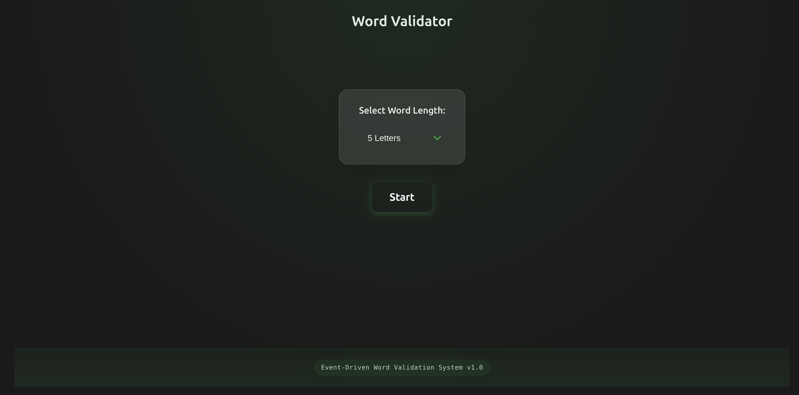
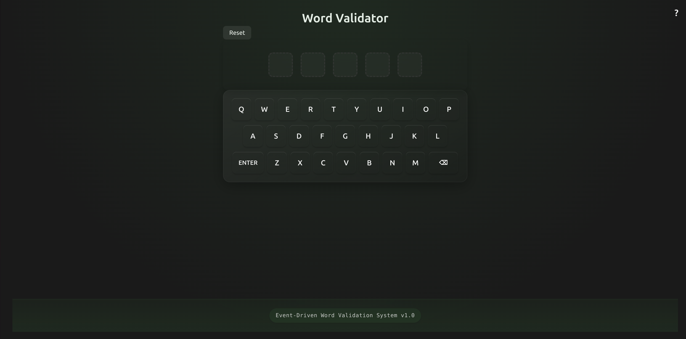

# Word Validation Assignment

A React-TypeScript application implementing a custom event system and word validation UI.

## Live Demo
🌐 [Try the application live](https://word-wizard-hi-fawn.vercel.app/)

## Screenshots

### Start Screen

- Select word length (default: 5 letters)
- Clean, minimalist design
- Dark theme interface

### Validator Screen

- Virtual QWERTY keyboard
- Word display squares
- Reset and Help buttons
- Visual feedback system

## Overview

### Part 1: Event System Implementation
- Custom event management system
- Multiple listener support per event
- Event registration and cleanup
- Error handling for unregistered events
- TypeScript implementation

### Part 2: Word Validation UI
- Interactive character input system
  - Left-to-right character placement
  - Maximum word length enforcement
  - Backspace functionality
  - Enter key validation
- Dictionary integration
  - Real-time word validation
  - Visual feedback (green/red borders)
  - Error handling

## Features

- Real-time character input
- Visual feedback for valid/invalid words
- Dictionary word validation
- Backspace functionality
- Enter key validation
- Responsive design

## Quick Start

```bash
# Install dependencies
npm install

# Start development server
npm run dev
```

## Development

### Prerequisites
- Node.js (v14+)
- npm or yarn

### Installation
```bash
git clone <repository-url>
cd word-validation-app
npm install
```